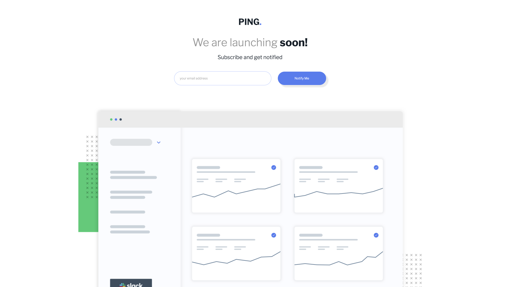

# Frontend Mentor - Ping coming soon page
This is a solution to the [Ping coming soon page challenge on Frontend Mentor](https://www.frontendmentor.io/challenges/ping-single-column-coming-soon-page-5cadd051fec04111f7b848da). Frontend Mentor challenges help you improve your coding skills by building realistic projects. 

## Overview

### The challenge

Users should be able to:

- View the optimal layout for the site depending on their device's screen size
- See hover states for all interactive elements on the page
- Submit their email address using an `input` field
- Receive an error message when the `form` is submitted if:
	- The `input` field is empty. The message for this error should say *"Whoops! It looks like you forgot to add your email"*
	- The email address is not formatted correctly (i.e. a correct email address should have this structure: `name@host.tld`). The message for this error should say *"Please provide a valid email address"*
### Screenshot

### Links

- Solution URL: [Add solution URL here](https://github.com/mays4/Ping-challenge.git)
- Live Site URL: [Add live site URL here](https://mays4.github.io/Ping-challenge/)

## My process

### Built with

- Semantic HTML5 markup
- CSS custom properties
-Js

## Author

- Website - [Mays Alraheem](https://github.com/mays4)